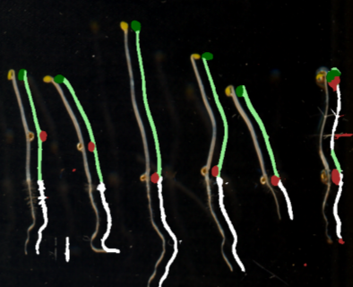

### Quantifying root length


## Setup

I'm using the environment
```
conda activate 2025_IMG
```

#### To do

- Generate a dedicated environment for this project.

## Project description

Color images of plants were taken using a scanner (a basic consumer model), with the aim of determining root lenghts
from these color pictures.

At this analysis stage, a set of scripts have already segmented images of roots. The image below shows an overlay both of segmentation and original picture of the plants.



**Image description:** *White is the root, green is the shoot, brown is the seed, and dark green are leaves (as determined by 
the segmentation).*

We want to determine the size of the root.

#### Definition of size

Size could be quantified in multiple ways, most straight-forward would be:
1. **length along the longest branch of the root**
2. total area

We'll use the first definition.

### Script 

*This is work in progress..*

This script does the following:

**Input:** `.npy` files with labeled masks that encode the segmentation. 
- 0 = background (colored black by my script)
- 1 = shoot (light green)
- 2 = root (white)
- 3 = seed (brown)
- 4 = leaf (dark green).

**Processing steps:**
1. Some cleanup on the segmentation
2. Skeletonize the root
3. Perform branch analysis to identify the largest branch
4. Calculate the length of the branch

**Output:** A dataframe with:
  - Sample name
  - Plant ID
  - Length of the root

## Detailed technical notes

### Branch analysis notes


| Root mask | Branch points removed | Labeled mask |
|--------|-------------|-----------|
|       |     |   |
|   XXXXX    |   XXXXX  |  XXXXX |


Graph:


