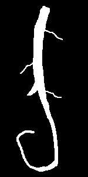
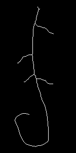
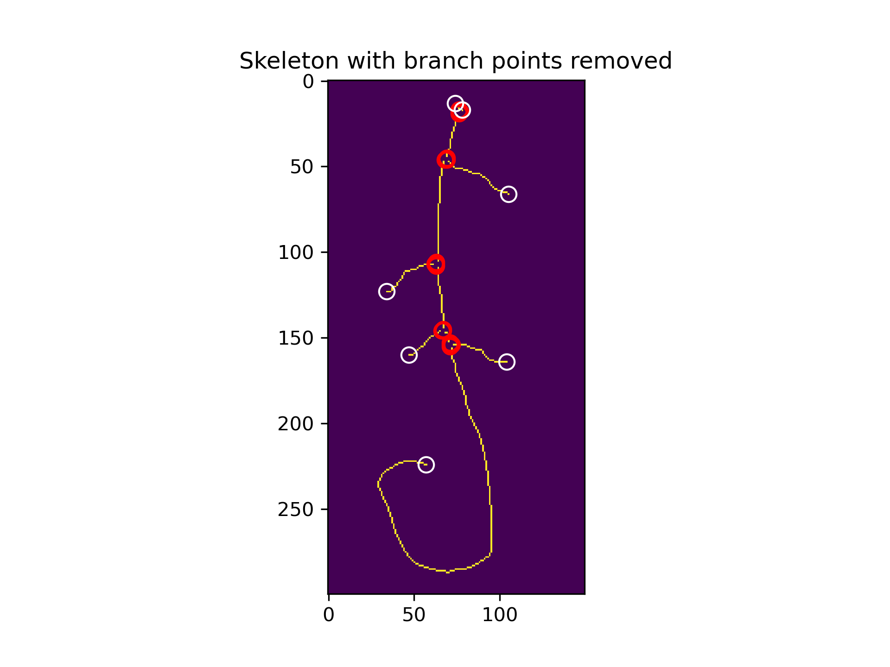
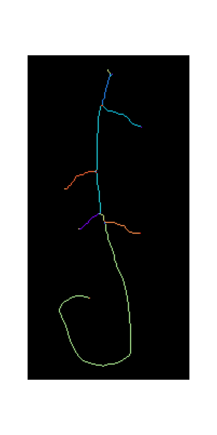
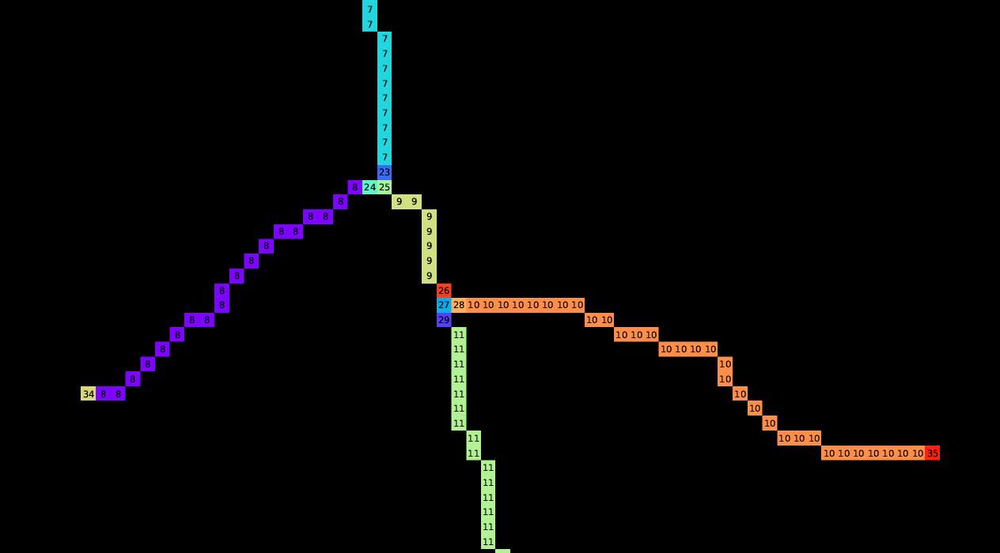
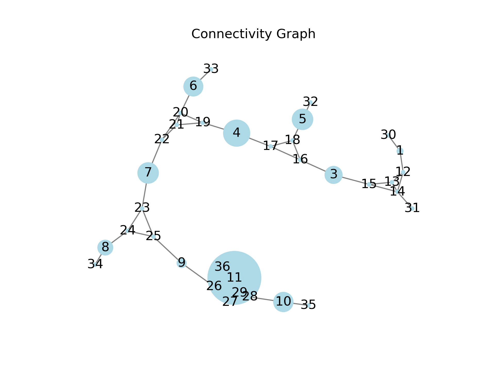

### Quantifying root length


## Setup

I'm using the environment
```
conda activate 2025_IMG
```

#### To do

- Generate a dedicated environment for this project.

## Project description

Color images of plants were taken using a scanner (a basic consumer model), with the aim of determining root lenghts
from these color pictures.

At this analysis stage, a set of scripts have already segmented images of roots. The image below shows an overlay both of segmentation and original picture of the plants.


**Image description:** *White is the root, green is the shoot, brown is the seed, and dark green are leaves (as determined by 
the segmentation).*

We want to determine the size of the root.

## Workflow and input/output directories

After having done an analysis, you might have a directory structure as follows. 
("Might have" since you can customize this.)

The original input folder, which might hold multiple subfolders with images:

- `<directory_with_raw_data>`
    - `<some_folder>`
        - `your_file.tif`
        - `(..)`
    - `(..)`

The output folder, which will be structured like this:

- `<data_output_folder>`
    - `LEN/`
        - `LEN/all_samples_length.xlsx` is a summary file which holds the plant root
        lengths for all analyzed plates from the input folder. You can use this for 
        plotting. Metadata about conditions can be added based on file and subfolder
        names.
        - `LEN/data` mirrors the original directory structure, where instead
        of pictures of plates, *there are `.tsv` files, which list the plant lengths
        in the plate. (Plants are assigned unique IDs.)*
        - `LEN/lenplots` mirrors the original directory structure, where instead
        of pictures of plates, *there are plots showing the plates with projected on top
        the lengths of each plant.*    
    - `SEG/`
        - `SEG/plots`  mirrors the original directory structure, where instead
        of pictures of plates, *there are plots showing the segmentation of the plants
        on top of the original image.*
        - `SEG/segfiles` mirrors the original directory structure, where instead
        of pictures of plates, *there are `.npz` datafiles, which each hold information 
        about the segmentation.

The files in the `SEG/` folder are generated by another set of scripts 
("Cheeky-cells"), which are stored in [another repository](https://github.com/Jintram/Cheeky-cells). The files in the `LEN/` folder are generated by the scripts
in this repository, based on the files in the `SEG/segfiles` folder. 

To generate this direcotry structure, in the script, set `DIR_INPUTFILES` to 
`<data_output_folder>/SEG/segfiles` and `DIR_OUTPUTFILES` to 
`<data_output_folder>/LEN/`.


## Technical comments

#### Definition of size

Size could be quantified in multiple ways, most straight-forward would be:
1. **length along the longest branch of the root**
2. total area

We'll use the first definition.

### Script 

*This is work in progress..*

This script does the following:

**Input:** `.npy` files with labeled masks that encode the segmentation. 
- 0 = background (colored black by my script)
- 1 = shoot (light green)
- 2 = root (white)
- 3 = seed (brown)
- 4 = leaf (dark green).

**Processing steps:**
1. Some cleanup on the segmentation
2. Skeletonize the root
3. Perform branch analysis to identify the largest branch
4. Calculate the length of the branch

**Output:** A dataframe with:
  - Sample name
  - Plant ID
  - Length of the root

## Detailed technical notes

### Branch analysis notes

| Root mask | Skeleton | Branch points removed | Labeled mask |
|--------|-------------|-----------|-------------|
|       |  |    |   |
|   A synthetic idealized image of a root. |  Skeletonized version of the root mask.  |  For all pixels, neighbour counts are determined. Pixels with >2 connected pixels are removed, such that separate branches can be identified by labeling the mask. (removed pixels highlighted with red squares). End points are identified as they have only 1 connected pixel (white squares). | Finally, a labeled mask is constructed based on the mask with removed branch points. Importantly, branch points are re-introduced, each with their unique label, for connectivity analysis. Also end points receive their own unique label. |

Zoom of labeled branching structure:


**Description of figure above.** *Zoomed version of the labeled mask with labels printed on top.*

Graph:


**Description of figure above.**  *Graph representation of the connected branches. The number corresponds to the label, the size of the circle to the area of the branch (ie number of pixels).*


