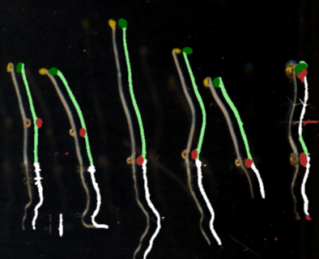
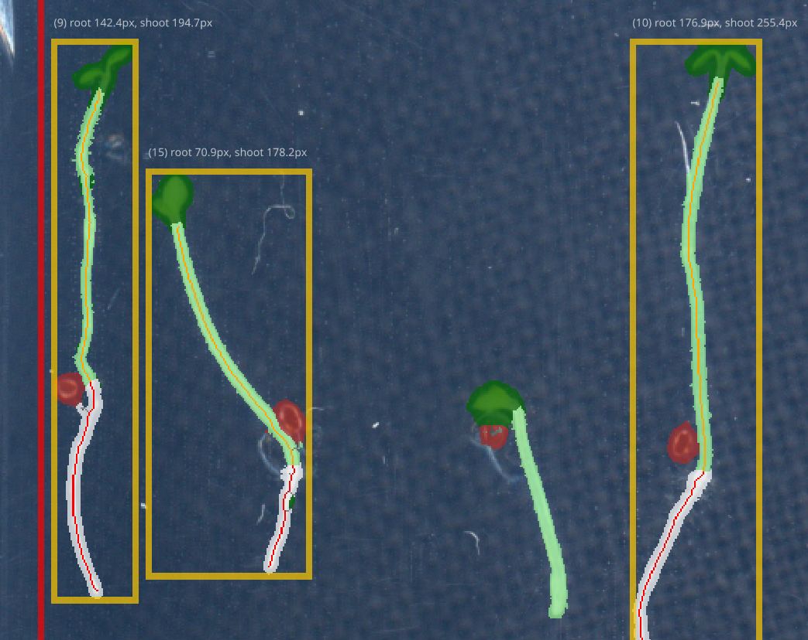
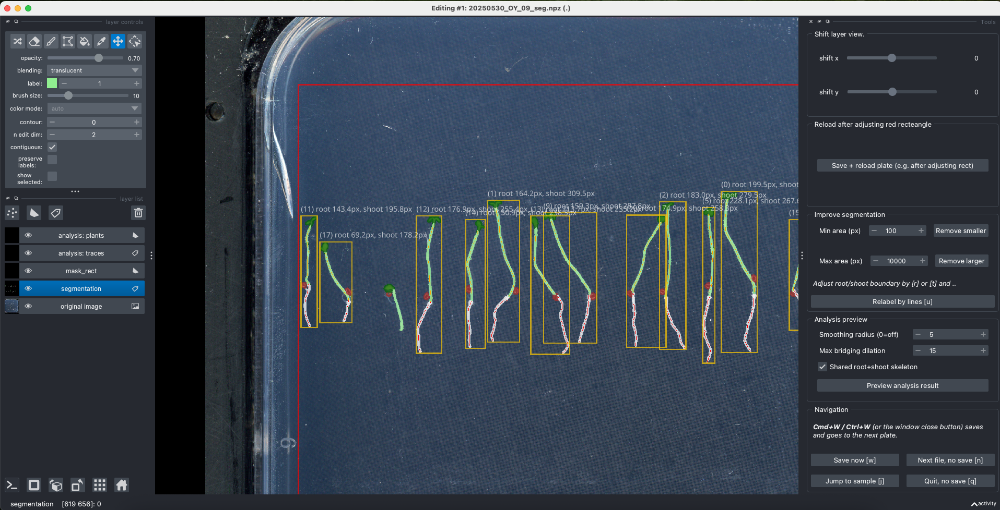

--------------------------------------------------------------------------------

# Quantifying plant root & shoot lengths

--------------------------------------------------------------------------------

## Project description

Color images of plants were taken using a scanner (a basic consumer model), 
with the aim of determining root and shoot lenghts from these color pictures.

### Part 1 segments plants

We use machine learning scripts (from the package [Cheeky-cells](https://github.com/Jintram/Cheeky-cells/), a set of scripts that allow training and 
segmenting of images) to segment the plant images.

<br>
***Figure.** Original image and segmentation overlay (shifted a few pixels to the 
right for visualization purposes). 
White is the root, green is the shoot, brown is the seed, and dark green are leaves (as determined by 
the segmentation). Minor artifacts can be addressed during manual correction
with a napari GUI. In this example, the right-most plant couldn't be
segmented properly.*

### Part 2 quantifies root & shoot lengths

We use the segmentation files from part 1 as input to determine the length of the root and shoot from each plant.


***Figure.** Example of length measurements.*


***Figure.** Screenshot of the GUI that allows manual corrections to 
the segmentation using a customized Napari window. It also includes a preview
of the length analysis result.*


--------------------------------------------------------------------------------

## Setup

I'm using the same environment as the [Cheeky_cells](https://github.com/Jintram/Cheeky-cells) package
to run these scripts. For installation instructions of that environment,
[see that repository](https://github.com/Jintram/Cheeky-cells).

```
conda activate cheeky-all
```

You will also need to install the [Cheeky_cells](https://github.com/Jintram/Cheeky-cells) package, 
see the [same url](https://github.com/Jintram/Cheeky-cells) as above. 

The Cheeky_cells package performs the segmentation.

### Download the scripts

To use them, you will need to put the scripts in this repository on your computer.

You can download them using the green "<> Code" button at the right top, and press "download zip".

A more advanced option is to set up git and clone the repository to your local computer, see below.

```
# Navigate to the directory you'd like to install the scripts
cd /path/to/your/directory

# Clone the repository using git
git clone git@github.com:Jintram/2025_Root-length.git
cd 2025_Root-length
```

Then, you need to run the following command (replace `/path/to/script/directory` by the actual path):

```
pip install -e /path/to/script/directory
```

--------------------------------------------------------------------------------

# How to use

--------------------------------------------------------------------------------

## Input/output directories

### Expected input folders

- You have your raw image data organized in a directory, which may also have
subdirectories that contain image data.

- `<directory_with_raw_data>`
    - `<some_folder>`
        - `your_file.tif`
        - `(..)`
    - `<some_other_folder>`
        - `<yet_another_folder>`
            - `yet_another_file.tif`
            - `(..)`
    - `(..)`
    - `your_other_file.tif`
    
### Output folders that will be generated

- The script will create two output folders, for which you need to specify a
location. It is convenient to create a new output folder, separate from the 
input folder (referred to below by `your/output/folder/`). The two output folders, `LEN` and `SEG` 
(names can be further customized), then look as follows:

- `your/output/folder/`
    - `SEG/`
        - `SEG/plots`  mirrors the original directory structure, where instead
        of pictures of plates, *there are plots showing the segmentation of the plants
        on top of the original image.*
        - `SEG/segfiles` mirrors the original directory structure, where instead
        of pictures of plates, *there are `.npz` datafiles, which each hold information 
        about the segmentation.
    - `LEN/`
        - `LEN/all_samples_length.xlsx` is a summary file which holds the plant root
        lengths for all analyzed plates from the input folder. You can use this for 
        plotting. Metadata about conditions can be added based on file and subfolder
        names.
        - `LEN/data` mirrors the original directory structure, where instead
        of pictures of plates, *there are `.tsv` files, which list the plant lengths
        in the plate. (Plants are assigned unique IDs.)*
        - `LEN/lenplots` mirrors the original directory structure, where instead
        of pictures of plates, *there are plots showing the plates with projected on top
        the lengths of each plant.*    

Because `LEN/data` contains a `.tsv` file for each plate, you can later
easily combine data from multiple datasets that were analyzed separately.


-----------------------------------------------------------------------------

## Part 1: Segmentation

### Loading libraries and setting up

This section describes how a segmentation run is 
executed. This is referred to as "phase 3" ("phase 1" is annotation of 
training data, and "phase 2" is training the segmentatino network).

Import the 'orchestrator', that module provides functions that calls the correct parts
of the scripts in this library.

```
import cheeky_cells.orchestrators.orchestrate_phase3_clean as o3
```

In addition, several plotting functions are supplied in library that
can be used to visualize the end result of the segmentation. 
Import the plotting library:

```
import cheeky_cells.plotting.plotting as pp
```

It is also convenient to define a custom color palette for the output.
This can be done as follows:

```
# Define the colors as an array of hex codes; this will correspond to 
# classes that are segmented
custom_colors_plantclasses = [
    '#000000', # class 0, background, black
    '#90EE90', # class 1, shoot, green
    '#FFFFFF', # class 2, root, white
    '#A52A2A', # class 3, seed, brown
    '#006400', # class 4, leaf, dark green
    '#FF0000', # optional bright red color
]

# now convert to ListedColormap 
from matplotlib.colors import ListedColormap
cmap_custom_plantclasses = ListedColormap(custom_colors_plantclasses)
```

### Configuration

Calling 
```
config3_ara_root = o3.Phase3Config(..)
```
will return an python object that stores parameters that tell
the scripts how to perform the run.

A typical configuration will look as the following example:

```
config3_ara_root = o3.Phase3Config(
    segmentation_dir = \
        '/Users/m.wehrens/Data_notbacked/2025_hypocotyl_images/SEG_2026_highresmodel-crop_TESTSET/',
    nr_classes = 5,
    nr_channels_input = 3, # (input is rgb, so 3 channels)
    model_checkpoint_to_load = \
        '/Users/m.wehrens/Data_UVA/2025_10_hypocotyl-root-length/TRAININGDIR_SET-1n2_20260618_cleaned/models/modelUNet20260619_2100__trained0d19h46m.pth',
    bg_percentile = 10,
    data_path_input = \
        '/Users/m.wehrens/Data_notbacked/2025_hypocotyl_images/DATA/tif/high_res/20250527/',
    fn_specific_preprocessing = None, # pp_ara.preprocess_getbbox_insideplate2,
    fn_plotting = pp.overlayplot,
    cmap_custom = plt_ara.cmap_custom_plantclasses,
    DPI_plots = 1200
)
```

The name `config3_ara_root` is arbitrary. In this example, the 3 refers to phase 3,
and `ara_root` to the type of data we're processing.

Using Python's `help(o3.Phase3Config)` function will give you documentation
on the parameters.
An excerpt for the parameters used above:

```
    segmentation_dir : str
        Directory where segmentation output will be put. Holds
        segfiles/<subdir>/, plots/<subdir>/, and log_segmentation.yaml.
        <subdir>/ will mimic the original subdirectories of the data input dir.
    nr_classes : int
        Number of different classes (things) to segment.
    nr_channels_input : int
        Type of input, typically 1 for gray scale, and 3 for color images.
    model_checkpoint_to_load : str
        Path to already trained model (.pth file) to be used for segmentation,
        e.g. <training_dir>/models/modelUNet20251026_1027.pth.
    bg_percentile : int
        Determines how images are normalized before shown to ML network.
        The percentile determines what is considered background, which will
        be subtracted to normalize the image intensity range.
    data_path_input : str
        Path to directory with images to segment. May contain subdirectories
        with images.
    fn_specific_preprocessing : Callable | None
        Optional preprocessing function that pre-processes all images to be
        segmented. Should look like:
        `img_toseg_prepr, prepr_info = config.fn_specific_preprocessing(img_toseg)`
        Where `img_toseg` and `img_toseg_prepr` are input and output image,
        `prepr_info` is additional information generated that also gets
        stored later in npz.
    fn_plotting : Callable | None
        If set, plots will be made using this function. Should look like:
        `fig, ax = config.fn_plotting(img, pred, cmap, ..)`
        where **config.extraplottingparams will be passed to the function as well.
    cmap_custom : ListedColormap | None
        Custom cmap of type matplotlib.colors.ListedColormap can be provided
        for predicted segmentation masks. If None, a default cmap will be used.
    DPI_plots : int
        Optional; DPI used for plots.
```

On other machine's than new macbooks, the `target_device` setting is relevant as well.

```
    target_device : str
        Torch device that the model and image tensors are moved to;
        'mps' (Apple Silicon), 'cuda' (NVIDIA) or 'cpu'. Note that 'cpu' will
        typically work on all machines, but will be very slow. Use 'mps' or
        'cuda' if available.
```

### Compiling list of image files to segment.

To start segmentation, the pipeline requires you to first compile a list of the 
images in your data directory, which can be done with 

```
config3_ara_root = o3.collect_filelist(config3_ara_root)
```

this will store a file list into the configuration object. 

If you like, you can inspect that file list,

```
config3_ara_root.df_metadata
```

yields:

```
	subdir	filename	segmentation_channel	train_or_test
0	.	20250530_OY_07.tif	all	
1	.	20250527_OY05.tif	all	
2	.	20250527_OY11.tif	all	 
(..)
```

The `segmentation_channel` and `train_or_test` are for advanced purposes, ie in case
you want to re-use this data for training.

For a general segmentation run, `<yourconfig>.df_metadata` just serves as a file list for all
the files you want to segment (in pandas dataframe format).

### Running the pipeline

Running the command `o3.segment_all_files(<yourconfig>)` will 
now automatically start segmenting the images in the folder 
set by `<yourconfig>.data_path_input`.

Additional options to the `o3.segment_all_files()` function are
`max_files_to_process` and `overwrite_files=True`, as can be found with 
`help(o3.segment_all_files)`.

```    
overwrite_files: 
    Boolean indicating whether to overwrite existing segmentation files.
max_files_to_process: 
    Maximum number of files to process. If None, process all files. 
    Intended for testing purposes.
```

The output will be saved to the directory 
`<yourconfig>.segmentation_dir`, which will contain two subfolders, `segfiles` and `plots`.
Under the section "Output folders that will be generated" this output directory is listed as
`SEG/`.

-----------------------------------------------------------------------------


## Part 2: manual correction + length analysis 


-----------------------------------------------------------------------------

# Installation instructions for developers

-----------------------------------------------------------------------------

- Contributors additionally install: `mamba install -c conda-forge pytest ruff`

-----------------------------------------------------------------------------

# Potential things to improve

-----------------------------------------------------------------------------

- Improve the cropping procedure (use another ML model to detect foreground/background?)

-----------------------------------------------------------------------------


