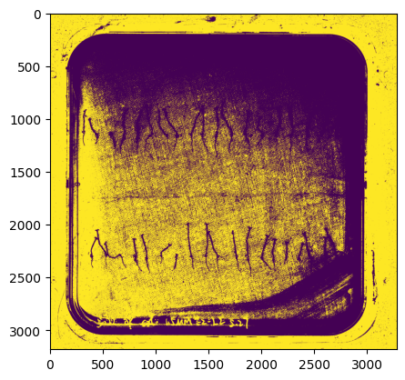

# Technical details

*Walkthrough of the pipeline and hierarchy of functions called.*

Note that this file only discusses the length analysis (part 2) of 
the pipeline, as part 1 is conducted using the 
[Cheeky-cells](https://github.com/Jintram/Cheeky-cells/)
package.

- `root_length/functions_files/filelisting.py`
    - function `gen_metadatafile_segfiles()` 
        - will search for `.npz` files in a given directory and subdirectory
        - stores filelist in pandas metadata dataframe
            - this dataframe simply has columns `basedir`, `subdir` and `filename`.
            - result stored typically as `df_filelist`
    
- `root_length/functions_pipeline/edit_segfiles.py`
    - `compute_and_save_mask_rect_all()` 
        - Given `df_filelist`, loops over files
            - file info is stored in `fileinfo` dataclass (from `filelisting.py`)
            - segfile contents and related image (required) are loaded
            - **artifact/legacy cropping** previously I allowed cropping at another time, 
            with segfile gettting cropped, but image not. `prepr_info` contains
            contains the rect, and cropping is applied to original img here as well.
                - currently intended usage will keep segfile full-sized, but 
                allow storing of `mask_rect` (determined with this function).
            - `preprocess_getbbox_insideplate2()` is called 
                - (defined in `root_length/functions_pipeline/preprocessing_seg.py`)
                - this is a simple function that detects the background
                around the plate and returns cropped `img_cropped, rect`
                - `rect` is manually adjusted to outline an ROI that
                covers the agar but not artifacts (margins are added). strategy;
                    - takes 50th percentile of grayscale img
                        - assumes to be agar background levels
                    - 
                    

 
***Figure.** Thresholded image by 50th percentile.*

