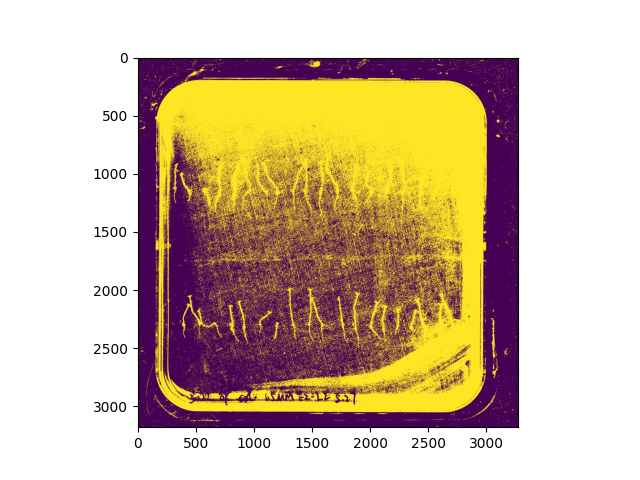
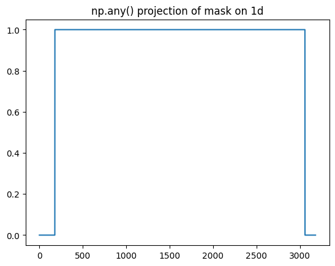
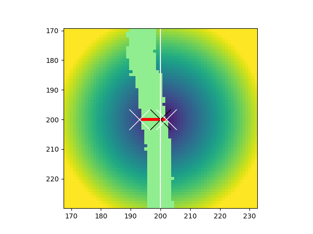
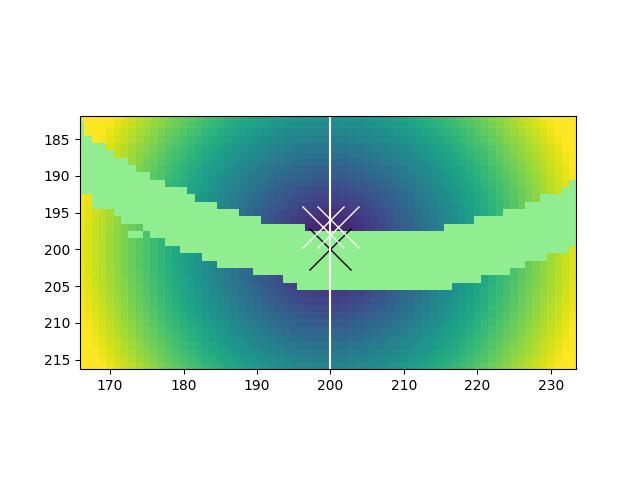

# Technical details

*Walkthrough of the pipeline and hierarchy of functions called.*

Note that this file only discusses the length analysis (part 2) of 
the pipeline, as part 1 is conducted using the 
[Cheeky-cells](https://github.com/Jintram/Cheeky-cells/)
package.

- `root_length/functions_files/filelisting.py`
    - function `gen_metadatafile_segfiles()` 
        - will search for `.npz` files in a given directory and subdirectory
        - stores filelist in pandas metadata dataframe
            - this dataframe simply has columns `basedir`, `subdir` and `filename`.
            - result stored typically as `df_filelist`
    
- call to `compute_and_save_mask_rect_all()` 
    - (defined in `root_length/functions_pipeline/edit_segfiles.py`)
    - Given `df_filelist`, loops over files
        - file info is stored in `fileinfo` dataclass (from `filelisting.py`)
        - segfile contents and related image (required) are loaded
        - **artifact/legacy cropping** previously I allowed cropping at another time, 
        with segfile gettting cropped, but image not. `prepr_info` contains
        contains the rect, and cropping is applied to original img here as well.
            - currently intended usage will keep segfile full-sized, but 
            allow storing of `mask_rect` (determined with this function).
        - `preprocess_getbbox_insideplate2()` is called 
            - (defined in `root_length/functions_pipeline/preprocessing_seg.py`)
            - this is a simple function that detects the background
            around the plate and returns cropped `img_cropped, rect`
            - `rect` is manually adjusted to outline an ROI that
            covers the agar but not artifacts (margins are added). strategy;
                - takes 50th percentile of grayscale img
                    - assumes to be agar background levels
                    - thus includes edges (bright)
                    - **completely** excludes background at side
                - calls `bbox_from_mask_light()`
                    - mask is projected to 1d for x and y using `any()`
                    - first and last non-zero elements are taken as boundary
                    - rect `r0, c0, r1, c1` is returned
                - use full pic if rect `< min_expected_area`.
                - add margins (allowed in `%` or `px`)
        - **artifact/legacy** optionally, outside mask zeroed; not meant as standard practice as 
        whole pipeline will understand the stored `mask_rect`
            - `_save_segfile()` is used to store the mask (`mask_rect`) in original segfile
                    

 
***Figure.** Thresholded image by 50th percentile.*

 
***Figure.** Resulting mask projected on 1d.*

- call to `edit_all_segfiles()`
    - (defined in `root_length/functions_pipeline/edit_segfiles.py`)
    - again loops over files using `df_filelist` and `curr_file` class
        - calls `edit_segfile_single()`
            - handles loading of segfile and image file
            - (again dealing with legacy crop_rect)
            - calls `edit_annotation_napari()`
                - Large, written by Claude
                - Calls the Napari GUI
                - Defines subfunctions to interact with segmentation
                    - Shift view (visual effect, Claude-written)
                    - `mask_rect` adjustment (with Napari layer, Claude-written)
                    - Remove small/large components (calls `remove_small_foregroundregions()` and `remove_large_foregroundregions()`)
                    - manually draw a new root/shoot boundary with **r**
                        - important function
                        - calls `correct_mask_rootshootline()`
                            - Places a seed pixel at mouse position (row, col) with label 5, then finds the nearest
                            background pixel (value == 0) to the left and right of the seed using
                            distance grid, and draws line between those two (using label 5).
                            
                            
                             
                            ***Left image.** Illustration of procedure. To the left
                            and right of the black cross (determined by the mouse click) the pixels with the lowest
                            distance (color-coded) outside the plant mask (light green) are located. Those
                            two pixels are connected by a boundary line (red). The **right image** shows a case
                            where this fails.*
                            
                            - Requires updating mask with "u" functionality (see below).
                    - manually draw a new root/shoot boundary with **t**
                        - important function
                        - calls `correct_mask_throughline()` 
                            - Places seed at mouse position, 
                            finds the nearest background pixel (bg1),
                            and then draws a line from bg1 to the seed, 
                            and continues until background is hit, thus
                            creating a new root/shoot boundary line.
                            - The idea is that when placed in the middle of 
                            the tissue, this will identify a line perpendicular 
                            to the curvature.
                            - TO DO: ADD ILLUSTRATION/LINK TO SCRATCH PAD CODE HERE? --> PERHAPS CREATE LITTLE
                            SCRIPT THAT DIRECTLY CALLS THIS FUNCTION BASED ON EXAMPLE?
                            - Requires updating mask with "u" functionality (see below).
                    - **u** functionality allows updating root shoot assignments
                    based on newly drawn root/shoot boundaries (**r** or **t**).
                        - calls `relabel_by_rootshootlines()`
                            - converts mask to binary and loops over blobs
                            - if red line;
                            - find CoM of blob 
                            - separate blob by red line
                            - assign sub-regions to root/shoot based on whether
                            sub-region CoM is above/below overall CoM. 
                            - all red lines will be assigned root identity
                    - Analysis preview; 
                        - invokes `root_length/functions_pipeline/napari_analysis.py`
                        - this performs an analysis round that would usually
                        be done in the rest of the pipeline. 
                        - not saved, because saving would create risk of 
                        all kinds of different settings being used per plate.
                    - Navigation functions, wich use local helpers to
                    allow saving+continue (auto behavior upon closing Napari GUI), 
                    save now, no save+continue, jumping
                    to sample N, quit no save.
                    
                    
            
